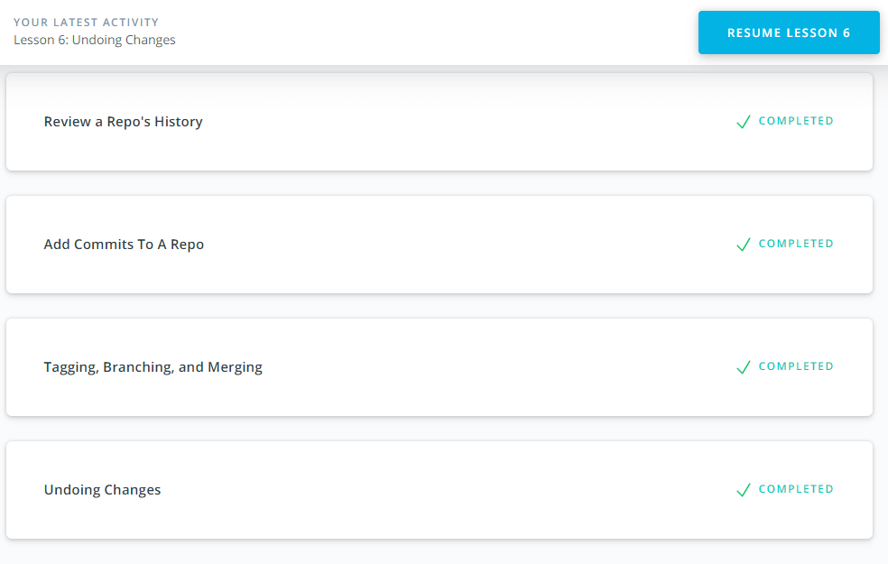
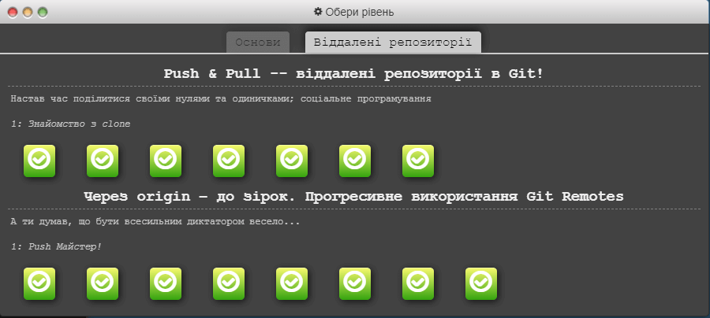
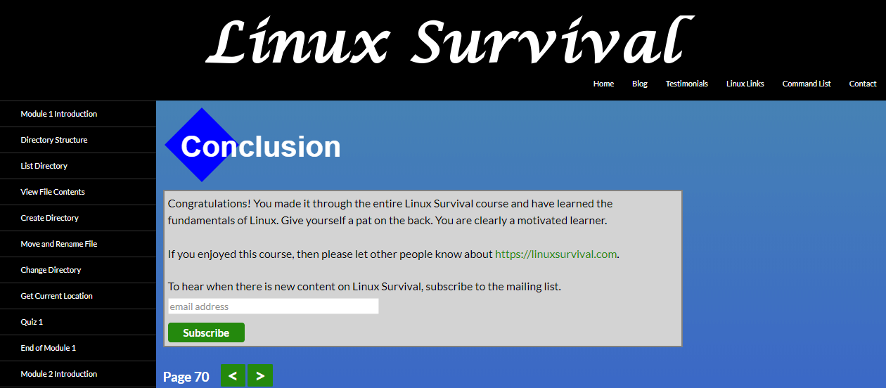

# Kottans Git Course
## Git Basics

### What learned a new one:
* I've learned some new command for a Git
* found out what the \*.md file was for
* learning about the markdown wanted to stuff everything here
* it was hard to come up with the third item in the list

***
## Linux CLI and HTTP
*It is very unusual to work from the command line.*

***
