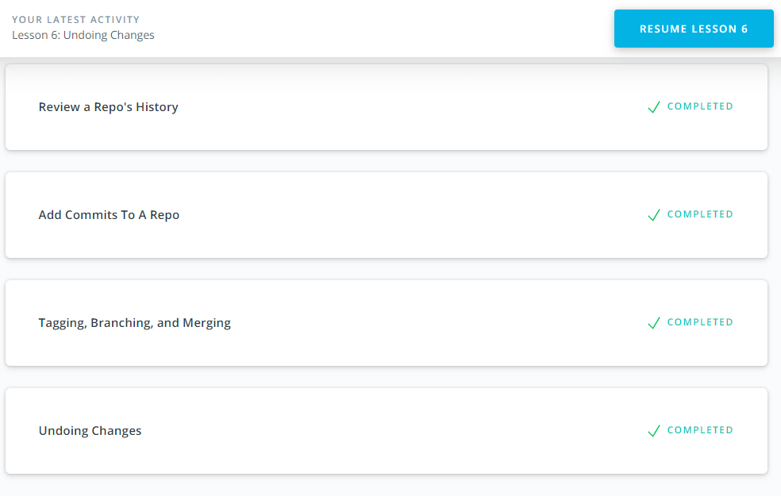
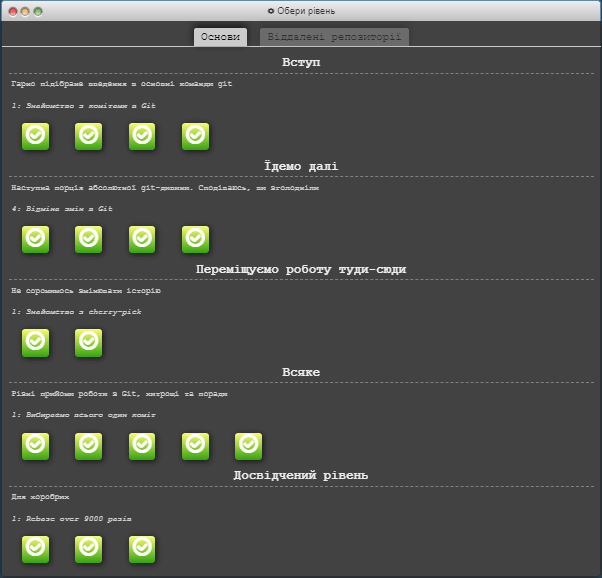
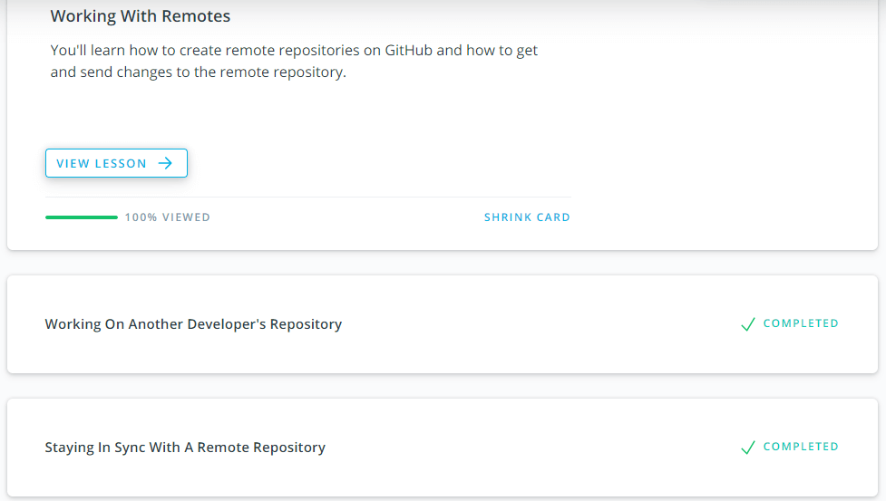
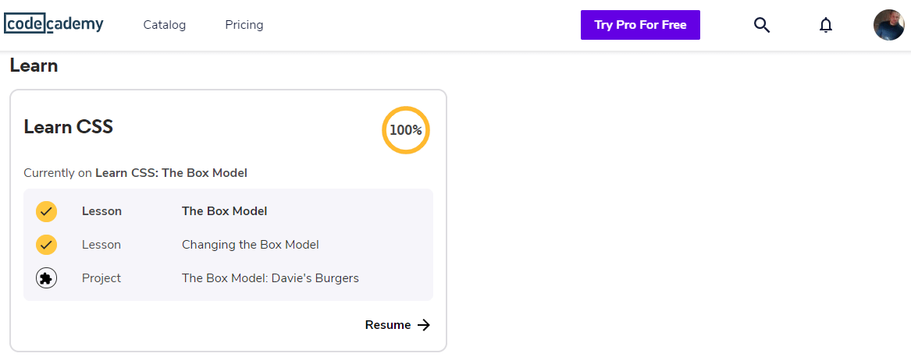
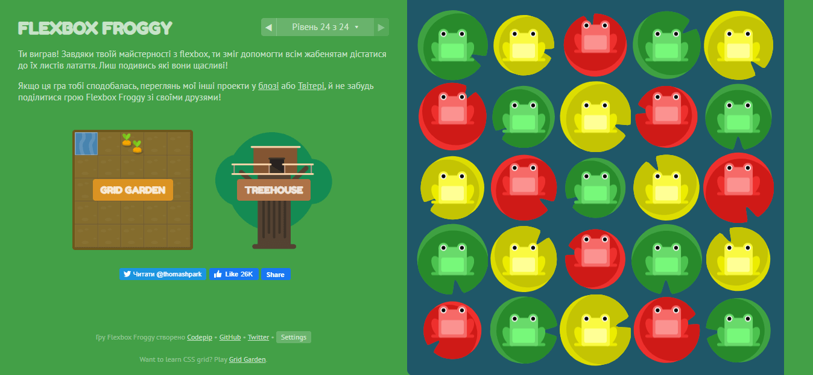
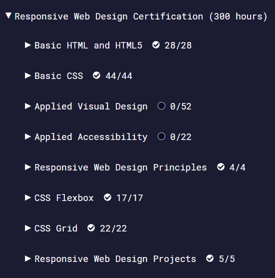
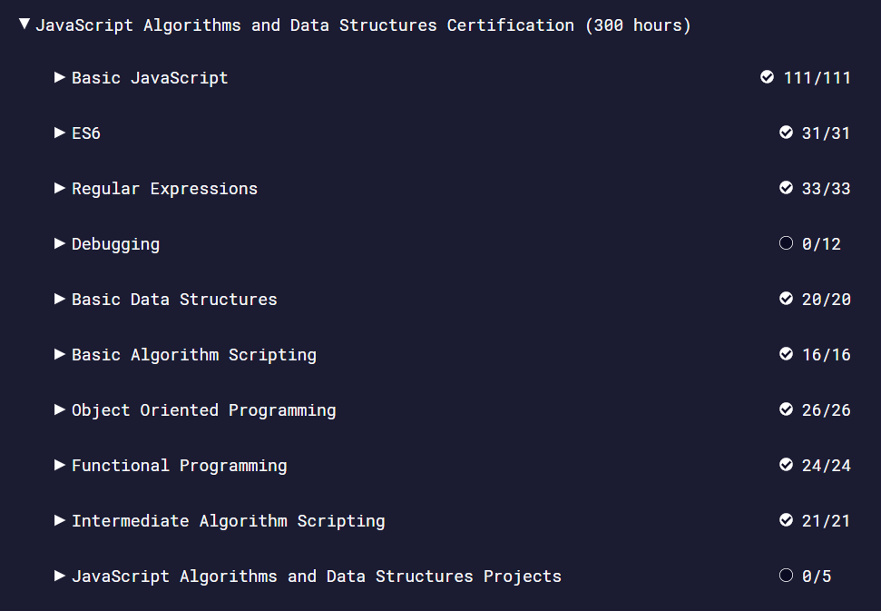

# Kottans Git Course

## My schedule and progress

- [x] [Git and GitHub](#git)
  - [Git Basics](#git-basics)
  - [Git Collaboration](#git-collaboration)
- [x] [Linux CLI and HTTP](#linux-cli-and-http)
- [x] [HTML & CSS](#html--css)
- [x] [JavaScript](#javascript)

## Git

### _Git Basics_

**What learned a new one:**

- [x] What is Version Control?
- [x] Create a Git Repo
- [x] Review a Repo's History
- [x] Add Commits To a Repo
- [x] Tagging, Branching, Merging
- [x] Undoing Changes
- [x] Push & Pull -- Git Remotes
- [x] Git commands: `init`, `clone`, `add`, `commit`, `checkout`, `branch`, `merge`, ...
      

      
Screenshot

      
      
      </detail>

### _Git Collaboration_

**What learned a new one:**

- [x] Working with remotes
- [x] Working on another developer's repo
- [x] Git commands: `push`, `fetch`, `pull`, ...
- [x] I am better understand pull request and Fork repo
- [x] Staying in Sync With A Remote Repo
      

      
Screenshot

      
      
      </detail>

---

## Linux CLI and HTTP

_It is very unusual to work from the command line._
**What learned a new one:**

- [x] I learned a few new useful commands like `find`, `cat`, `grep` and `echo`.
- [x] I intend to use such commands: `ls`, `cd`, `touch`, `mkdir`, `pwd`, `chmod`, `grep`, ...
- [x] navigation across file system
- [x] manipulating files
- [x] security, permissions, users and groups, user info
- [x] important locations in the file system
- [x] built-in help
- [x] output redirection and piping
- [x] printing
- [x] wild cards and patterns
- [x] finding files and text
- [x] processes
      

      
Screenshot

      
      </detail>

---

## HTML & CSS

**What learned a new one:**

- [x] Selectors and Visual Rules
- [x] The Box Model
- [x] Display and Positioning
- [x] Colors & Typography
- [x] Flexbox
- [x] Grid
      

      
Screenshot

      
      
      
      </detail>

---

## Javascript

**What learned a new one:**

- [x] Basic javascript
- [x] ES6
- [x] Regular expression
- [ ] Debugging
- [x] Basic data structures
- [x] Basic algorithm scripting
- [x] Object oriented programming
- [x] Functional programming
- [x] Intermediate algorithm scripting
- [ ] JavaScript algorithms and data structures projects
      

      
Screenshot

      
      </detail>

---

## Document Object Model

- **What learned a new one:** text placeholder
- **What surprised** text placeholder
- **What will be used in practice** text placeholder
- **General overview** text placeholder

---
